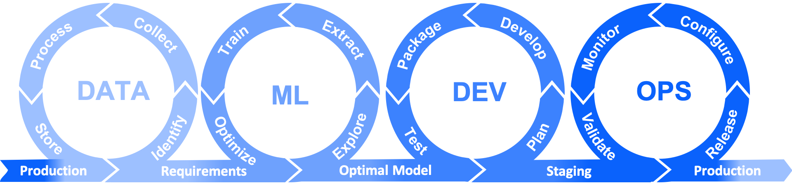

# Integrating-ML-and-DevOps

### What is Machine Learning?
Machine learning is an application of artificial intelligence (AI) that provides systems the ability to automatically learn and improve from experience without being explicitly programmed. Machine learning focuses on the development of computer programs that can access data and use it learn for themselves.  

The process of learning begins with observations or data, such as examples, direct experience, or instruction, in order to look for patterns in data and make better decisions in the future based on the examples that we provide. The primary aim is to allow the computers learn automatically without human intervention or assistance and adjust actions accordingly.  

### Mnist handwritten dataset  
The MNIST database of handwritten digits, available from this page, has a training set of 60,000 examples, and a test set of 10,000 examples. It is a subset of a larger set available from NIST. The digits have been size-normalized and centered in a fixed-size image.  
It is a good database for people who want to try learning techniques and pattern recognition methods on real-world data while spending minimal efforts on preprocessing and formatting.  

Four files are available on this site:  

train-images-idx3-ubyte.gz:  training set images (9912422 bytes)  
train-labels-idx1-ubyte.gz:  training set labels (28881 bytes)  
t10k-images-idx3-ubyte.gz:   test set images (1648877 bytes)  
t10k-labels-idx1-ubyte.gz:   test set labels (4542 bytes)  

